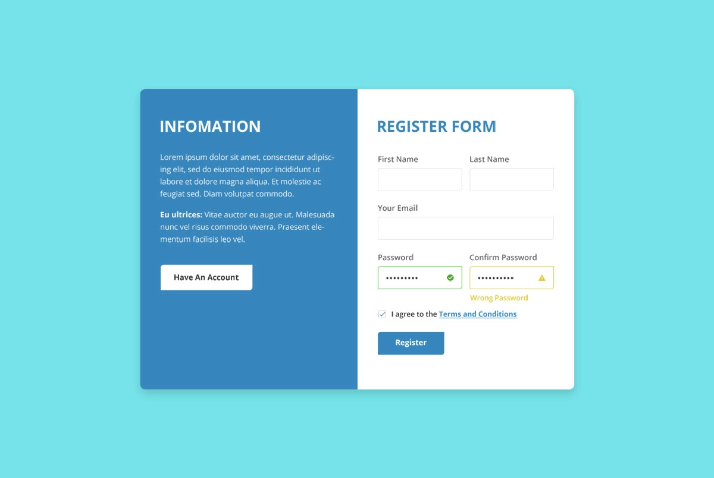

# Tela de Login

Este é um modelo simples de página de login em HTML que consiste em duas seções principais: uma barra de informações e um formulário de registro.

## Barra de Informações

A barra de informações contém texto de informações gerais junto com um botão para navegar para a seção de registro se o usuário já tiver uma conta.

## Formulário de Registro

O formulário de registro inclui campos para o usuário inserir seu primeiro nome, último nome, endereço de e-mail, senha e confirmar a senha. Além disso, há uma caixa de seleção para concordar com os termos e condições.

### Campos do Formulário:

- **Primeiro Nome**: Campo de entrada para o primeiro nome do usuário.
- **Sobrenome**: Campo de entrada para o último nome do usuário.
- **E-mail**: Campo de entrada para o endereço de e-mail do usuário.
- **Senha**: Campo de entrada para a senha do usuário.
- **Confirmar Senha**: Campo de entrada para confirmar a senha do usuário.
- **Termos e Condições**: Caixa de seleção para o usuário concordar com os termos e condições.

## Utilização

Para usar este modelo, basta baixar o arquivo HTML junto com os arquivos CSS e JavaScript associados (`index.css` e `index.js`, respectivamente).
Personalize os estilos e a funcionalidade conforme necessário para o seu projeto.

